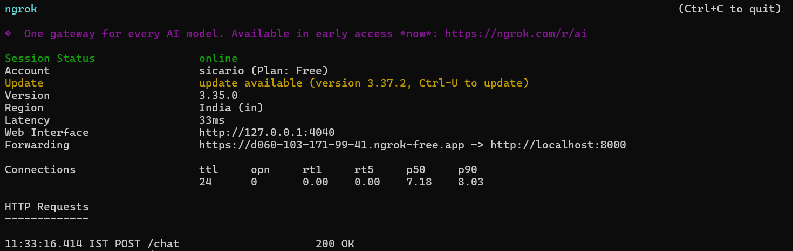
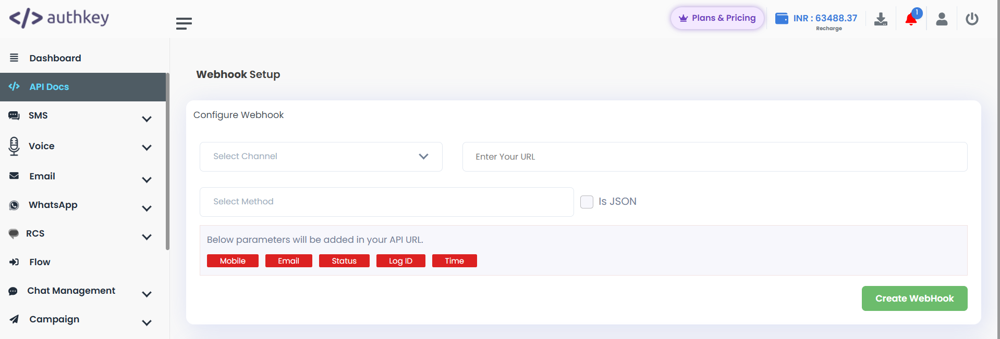
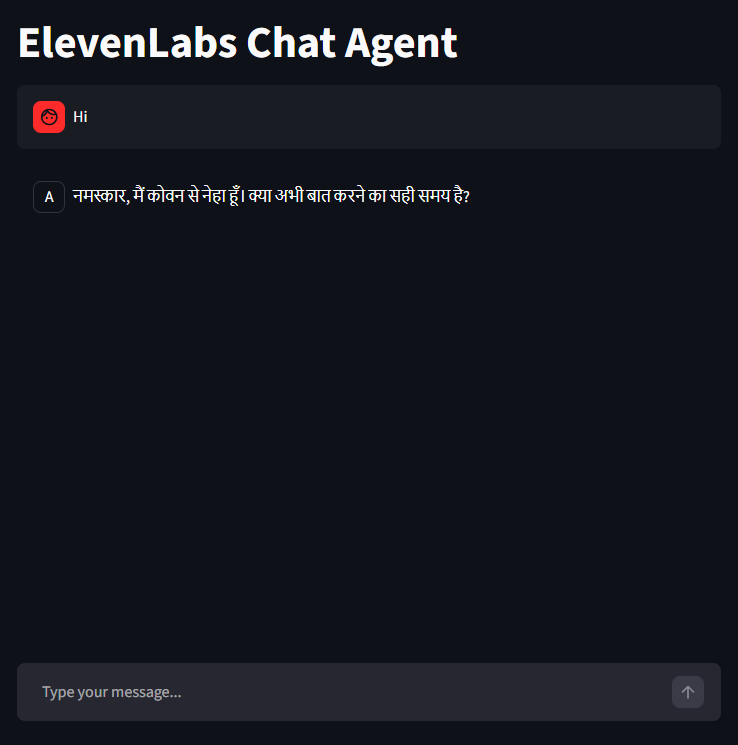

# 🎙️ ElevenLabs WhatsApp Bot

Reuses an ElevenLabs voice agent’s conversation flow to power a text-based WhatsApp chatbot using the Authkey gateway.

---

## Overview

This integration bridges ElevenLabs Conversational AI with WhatsApp:
* **Webhook Integration:** Receives incoming WhatsApp messages via Authkey.
* **AI Processing:** Sends user input to ElevenLabs (text-only mode) to maintain the agent's logic and personality.
* **Seamless Response:** Routes the agent's response back to the user on WhatsApp.

---

## Setup Guide

### 1. Installation
Clone the repository and install the required dependencies:
```bash
git clone https://github.com/swaraj-khan/elevenlabs-whatsapp-bot.git
pip install -r requirements.txt
```

### 2. Launch the Server

```bash
uvicorn ws_server:app --host 0.0.0.0 --port 8000 --reload
```
POST /chat

### 3. Expose to the Web
```bash
ngrok http 8000
```

*Fig 1: NGROK setup*

You must add ```/chat```
```
https://<your-ngrok-url>/chat
```
### 4. Authkey Configuration
- Log in to Authkey.io.
- Go to Dashboard → Webhook Setup.
- Configure the following settings:
  - **Method:** POST
  - **URL:** `https://<your-ngrok-url>/chat`

---



*Fig 2: Authkey webhook*

## Local Testing (Streamlit UI)

Before testing on WhatsApp, you can verify your agent's conversation flow using the built-in Streamlit interface:


```bash
streamlit run app.py
```


*Fig 3: Streamlit UI*

---
